# Project Portfolio
Project ini adalah membuat portfolio, dimana portfolio tersebut harus bisa mengambil data dari database. Kemudian portfolio tersebut juga harus bisa menampilkan halaman public dan admin. Halaman admin berfungsi untuk mengedit profile, menambah skill dan project, menghapus skill dan project, dan mengedit skill dan project.

**Cara menjalankan aplikasi:**
1. Saat aplikasi dijalankan anda akan masuk ke halaman public yang terdiri dari navbar home, skills, projects, dan login, serta halaman home, skills, dan project.
2. Untuk masuk ke halaman admin, anda harus menekan navbar login dan mengisi username serta password.
3. Setelah masuk, navbar yang tadinya ada 4, bertambah menjadi 5 (home, skills, projects, edit profile, logout). Di bagian skills dan project bertambah satu box disebelahnya, yaitu box tambah. Di bagian skills dan projects juga akan muncul toogle di setiap box yang jika ditekan akan ada pilihan edit dan hapus.
4. Jika admin menekan navbar edit profile, admin akan langsung diarahkan untuk mengisi form dari data yang akan diedit. Admin bisa mengedit nama, bio, dan photo.
5. Setelah mengisi bagian yang akan diubah. Admin bisa menekan tombol submit dan perubahan akan disimpan.
6. Jika admin menekan tombol tambah skill dan tambah project, admin akan diarahkan untuk mengisi form dari data yang baru.
7. Jika sudah, admin bisa menekan tombol submit dan data yang baru akan ditambahkan.
8. Jika admin menekan tombol edit untuk salah satu skill dan project, admin akan diarahkan untuk mengisi form dari data mana yang mau diubah.
9. Setelah mengisi bagian yang akan diubah. Admin bisa menekan tombol submit dan perubahan akan disimpan.
10. Jika admin menekan tombol delate, skill atau project yang dipilih akan dihapus datanya.
11. Terakhir, jika admin menekan tombol logout, dia akan kembali ke halaman public.

 **Screenshot Tampilan**
1. Home Public
   
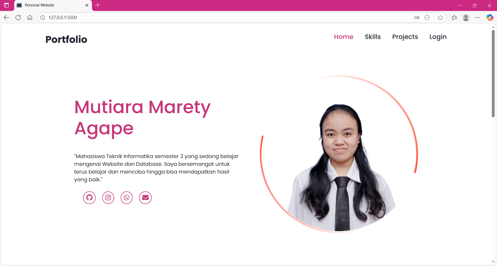

2. Skills Public
   
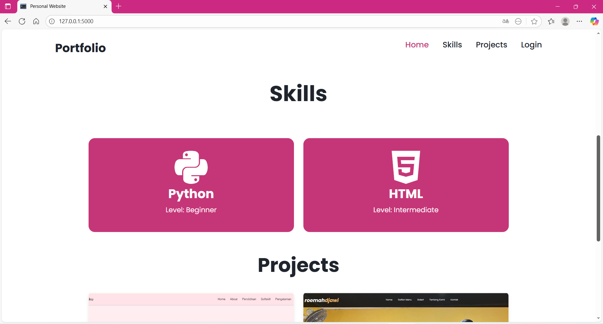

3. Projects Public
   
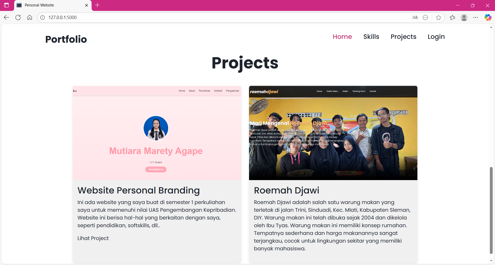

4. Login
   
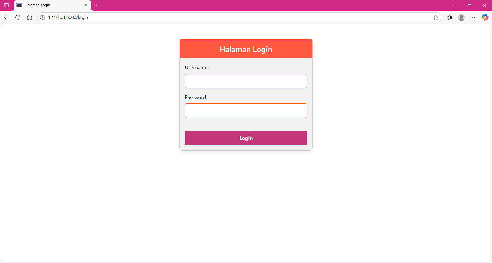

5. Home Admin
   
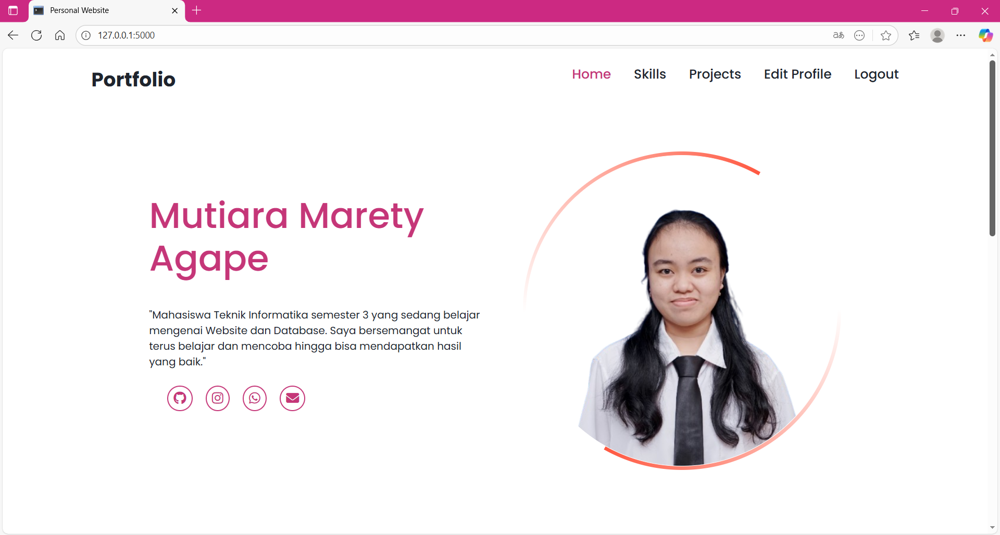

6. Skills Admin
   
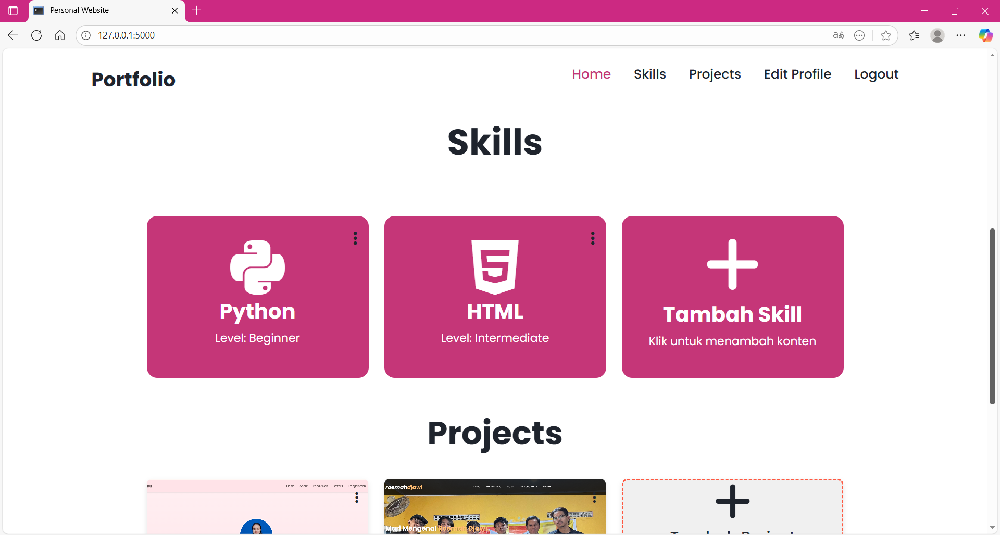

7. Projects Admin
   
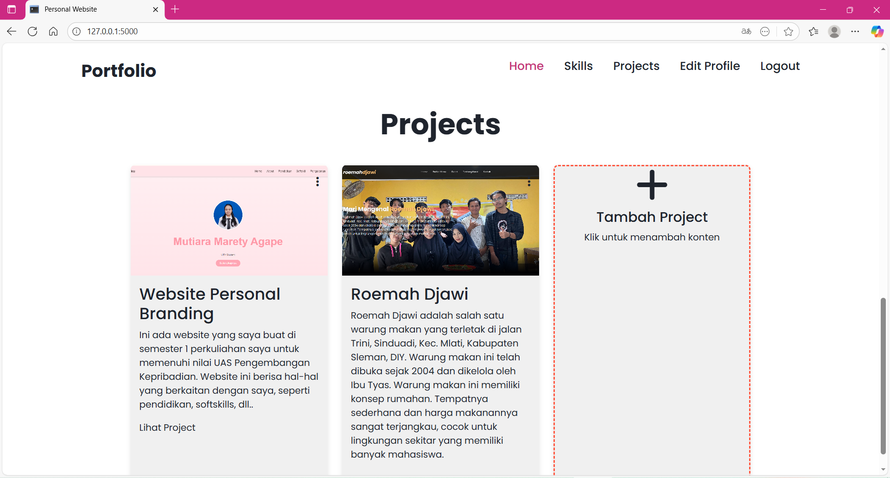

8. Edit Profile
   
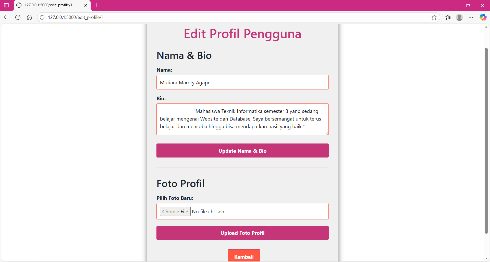

9. Edit Skills
   
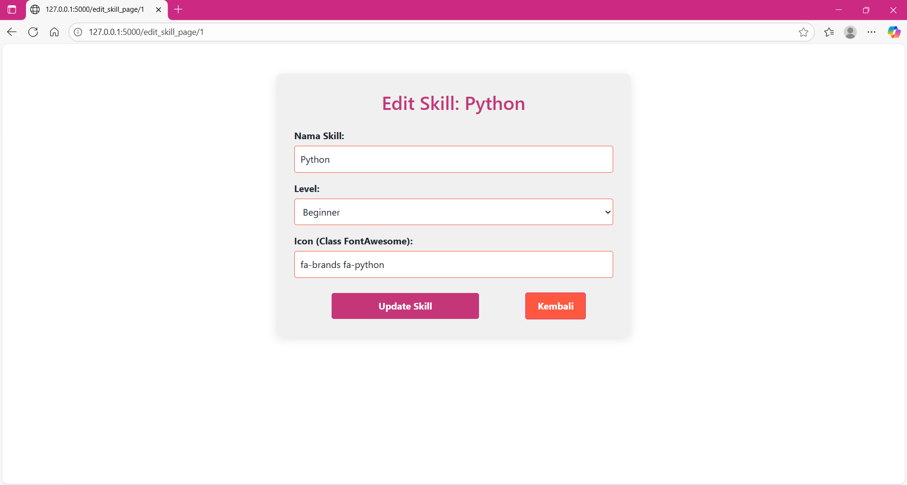

10. Hapus Skills
    
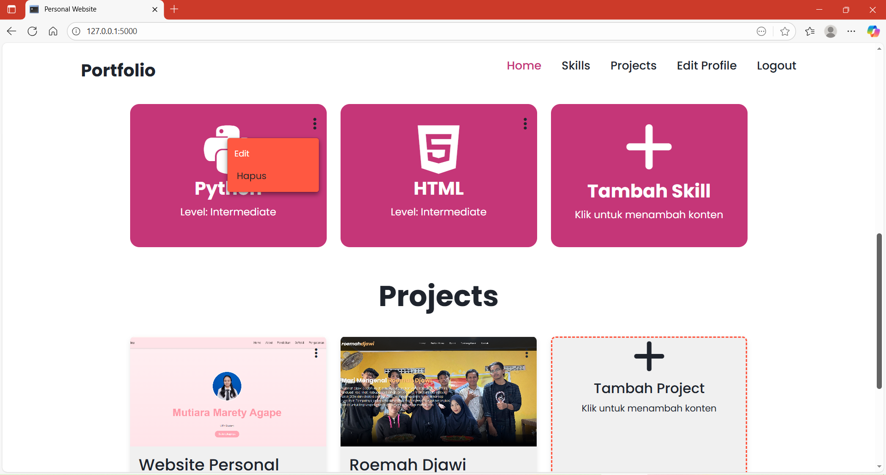

11. Tambah Skills
    
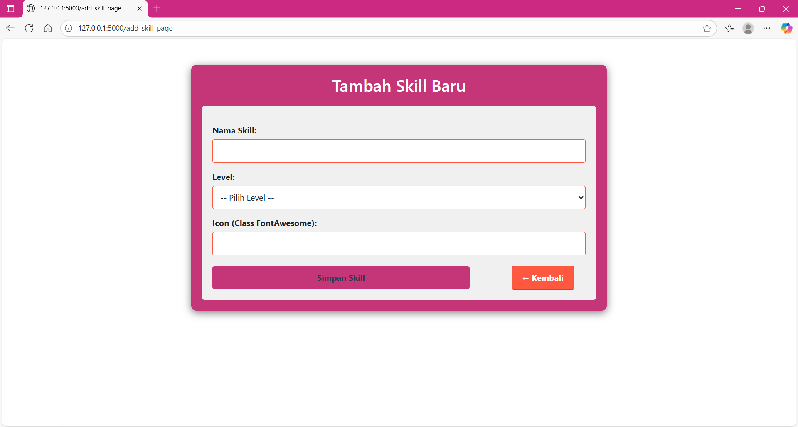

12. Edit Projects
    
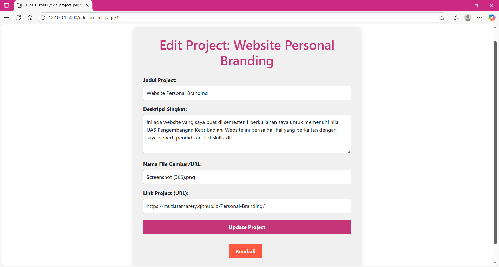

13. Hapus Projects
    
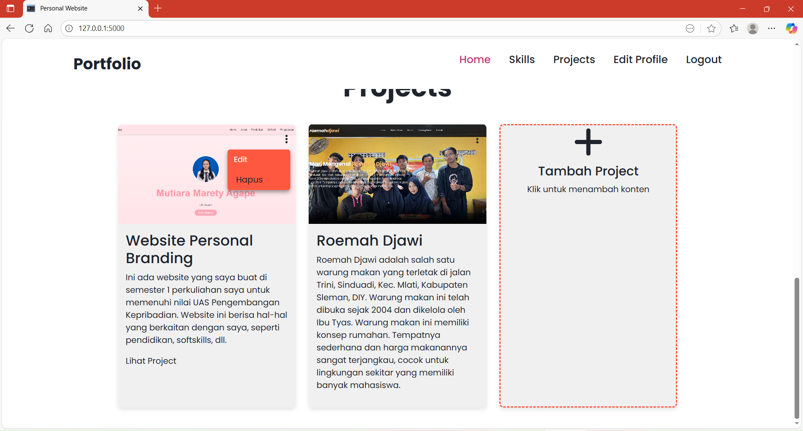

14. Tambah Project
    
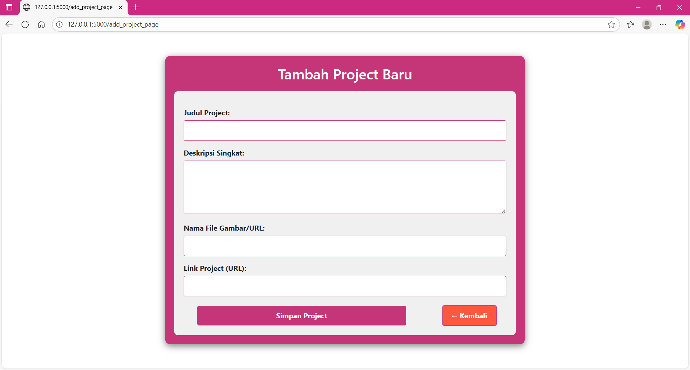

